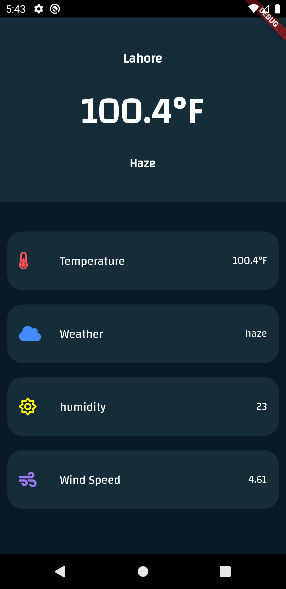

<html>
<body>
<h1>Weather Forecasting App</h1>  

An Weather Forecasting App which let users to see Temprature, Weather, Humidity and Wind Speed. 
This is Simple Flutter app, which uses OpenWeather API.

 
  

<h3>Animations used in app</h3>
  <h4><ul>
  <li>Lottie Animation</li>
</ul></h4>

<h1>API Information</h1>
A scientific yet simple approach to weather forecast. Free. No ads.
https://openweathermap.org/

<h1>Application UI</h1>

 

</body>
</html>
